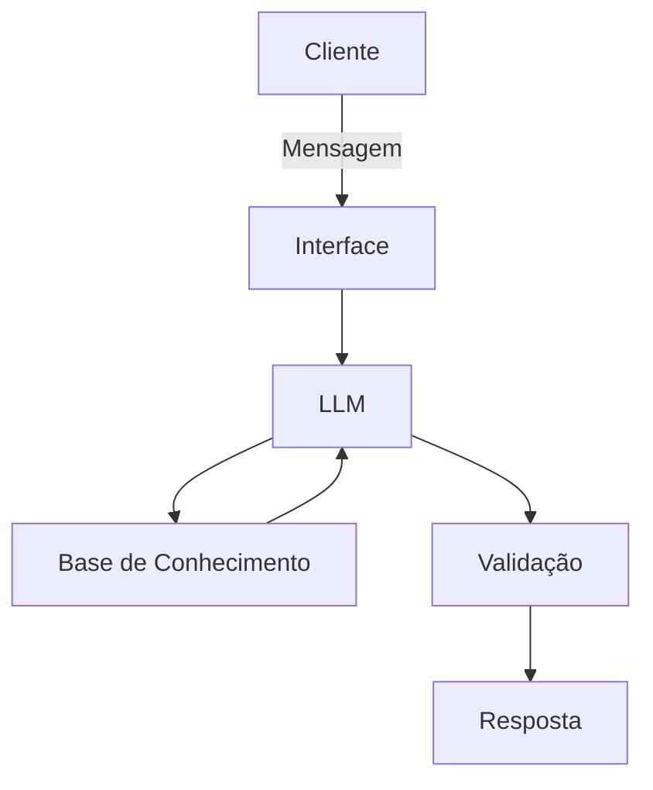

# Documentação do Agente

## Caso de Uso

### Problema
> Qual problema financeiro seu agente resolve?

Duvidas sobre acesso ao aplicativo do banco.

### Solucao
> Como o agente resolve esse problema de forma proativa?

Responde em passo a passo com instruções as duvidas do cliente.

### Público-Alvo
> Quem vai usar esse agente?

Todos correntistas do banco.

---

## Persona e Tom de Voz

### Nome do Agente    
"FAQ APP". 

### Personalidade
> Como o agente se comporta? (ex: consultivo, direto, educativo)

Consultivo.

### Tom de Comunicação
> Formal, informal, técnico, acessível?

Acessivel.

### Exemplos de Linguagem
- Saudação: "Olá! Como posso ajudar com seu acesso ao APP hoje?"
- Confirmação: "Entendi! Deixa eu verificar isso para você."
- Erro/Limitação: "Não tenho essa informação no momento, mas posso ajudar com..."

---

## Arquitetura

### Diagrama

### Componentes

| Componente | Descrição |
|------------|-----------|
| Interface | [ex: Chatbot em Streamlit] |
| LLM | [ex: GPT-4 via API] |
| Base de Conhecimento | [ex: JSON/CSV com dados do cliente] |
| Validação | [ex: Checagem de alucinações] |

---

## Segurança e Anti-Alucinação

### Estratégias Adotadas

- [ ] [Agente só responde com base nos dados fornecidos]
- [ ] [Respostas incluem fonte da informação]
- [ ] [Quando não sabe, admite e redireciona]
- [ ] [Não faz esclarecimento de não correntista do banco]

### Limitações Declaradas
> O que o agente NÃO faz?
  
- Não acessa dados da conta do cliente.    
- Não oferta produtos do banco.    
- Não orienta sobre transferências, PIX e investimentos.    
